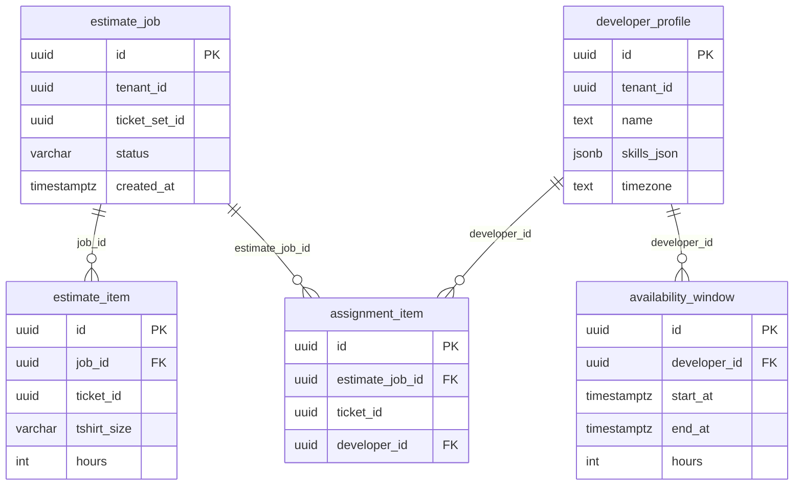

# Estimator Service ERD

Assumption: assignment_item.ticket_id refers to a ticket in the Ticket Slicer service (cross-service logical reference).

```mermaid
erDiagram
  estimate_job ||--o{ estimate_item : "job_id"
  estimate_job ||--o{ assignment_item : "estimate_job_id"
  developer_profile ||--o{ availability_window : "developer_id"
  developer_profile ||--o{ assignment_item : "developer_id"

  estimate_job {
    uuid id PK
    uuid tenant_id
    uuid ticket_set_id
    varchar status
    timestamptz created_at
  }

  estimate_item {
    uuid id PK
    uuid job_id FK
    uuid ticket_id
    varchar tshirt_size
    int hours
  }

  developer_profile {
    uuid id PK
    uuid tenant_id
    text name
    jsonb skills_json
    text timezone
  }

  availability_window {
    uuid id PK
    uuid developer_id FK
    timestamptz start_at
    timestamptz end_at
    int hours
  }

  assignment_item {
    uuid id PK
    uuid estimate_job_id FK
    uuid ticket_id
    uuid developer_id FK
  }
```
