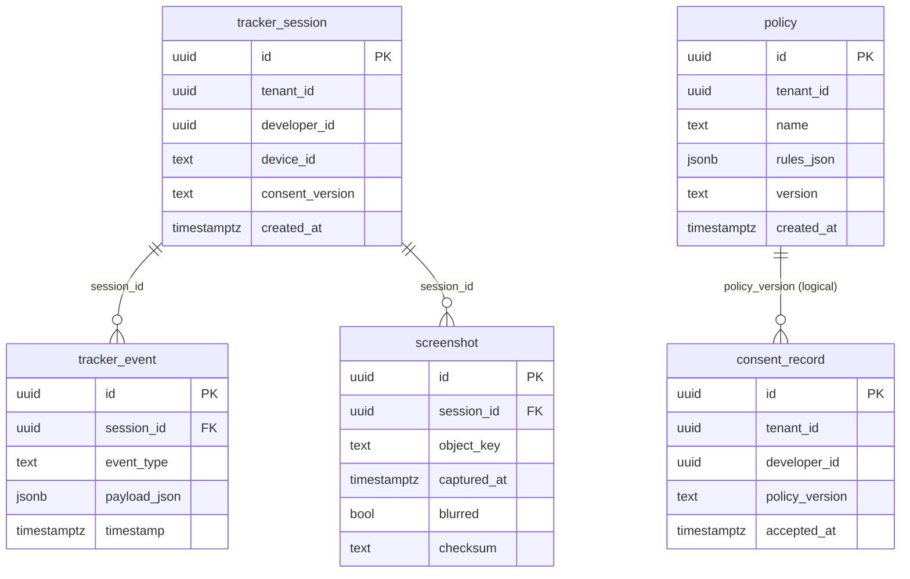

# Tracker Service ERD

Assumption: consent_record.policy_version corresponds to policy.version; the link is enforced at the application layer.
Assumption: consent_record.developer_id refers to developer_profile in the Estimator service (cross-service logical reference).

