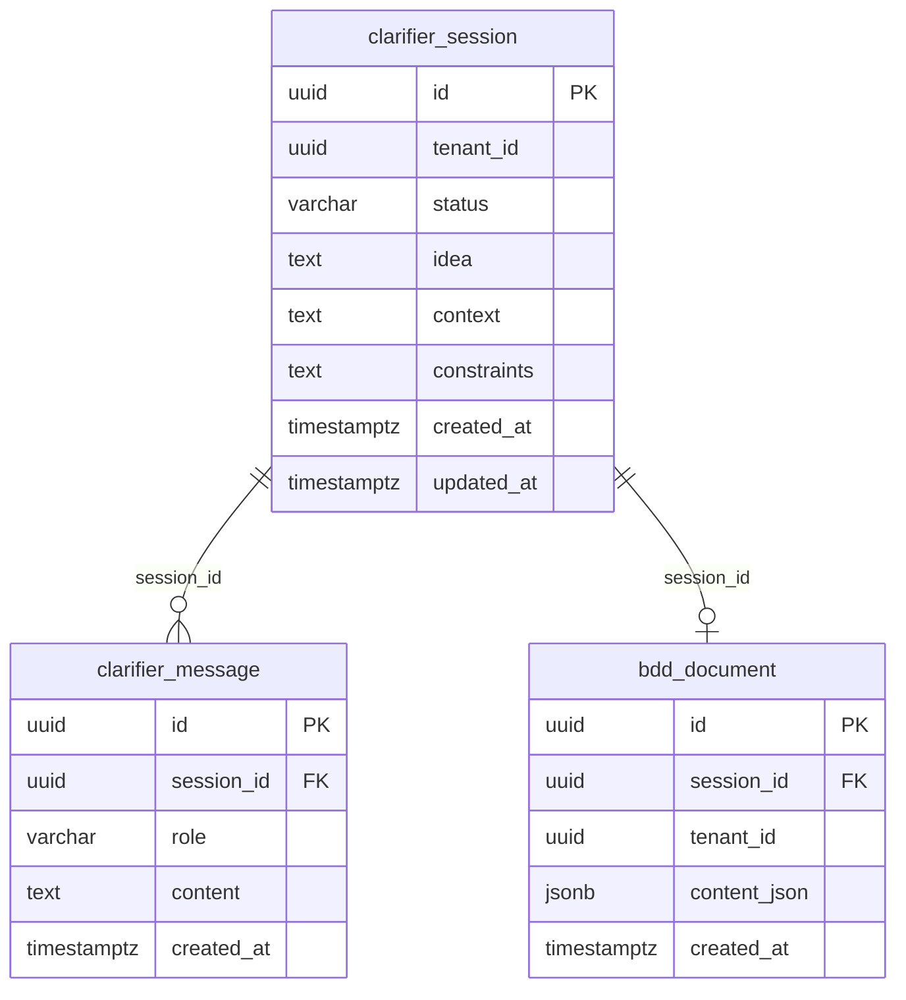

# Clarifier Service ERD

```mermaid
erDiagram
  clarifier_session ||--o{ clarifier_message : "session_id"
  clarifier_session ||--o| bdd_document : "session_id"

  clarifier_session {
    uuid id PK
    uuid tenant_id
    varchar status
    text idea
    text context
    text constraints
    timestamptz created_at
    timestamptz updated_at
  }

  clarifier_message {
    uuid id PK
    uuid session_id FK
    varchar role
    text content
    timestamptz created_at
  }

  bdd_document {
    uuid id PK
    uuid session_id FK
    uuid tenant_id
    jsonb content_json
    timestamptz created_at
  }
```
