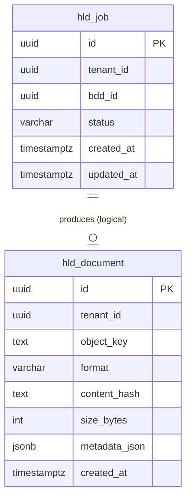

# HLD Draft Service ERD

Assumption: hld_job is associated with a single hld_document via document_id in the job result; no FK is enforced in the DDL.

```mermaid
erDiagram
  hld_job ||--o| hld_document : "produces (logical)"

  hld_job {
    uuid id PK
    uuid tenant_id
    uuid bdd_id
    varchar status
    timestamptz created_at
    timestamptz updated_at
  }

  hld_document {
    uuid id PK
    uuid tenant_id
    text object_key
    varchar format
    text content_hash
    int size_bytes
    jsonb metadata_json
    timestamptz created_at
  }
```
