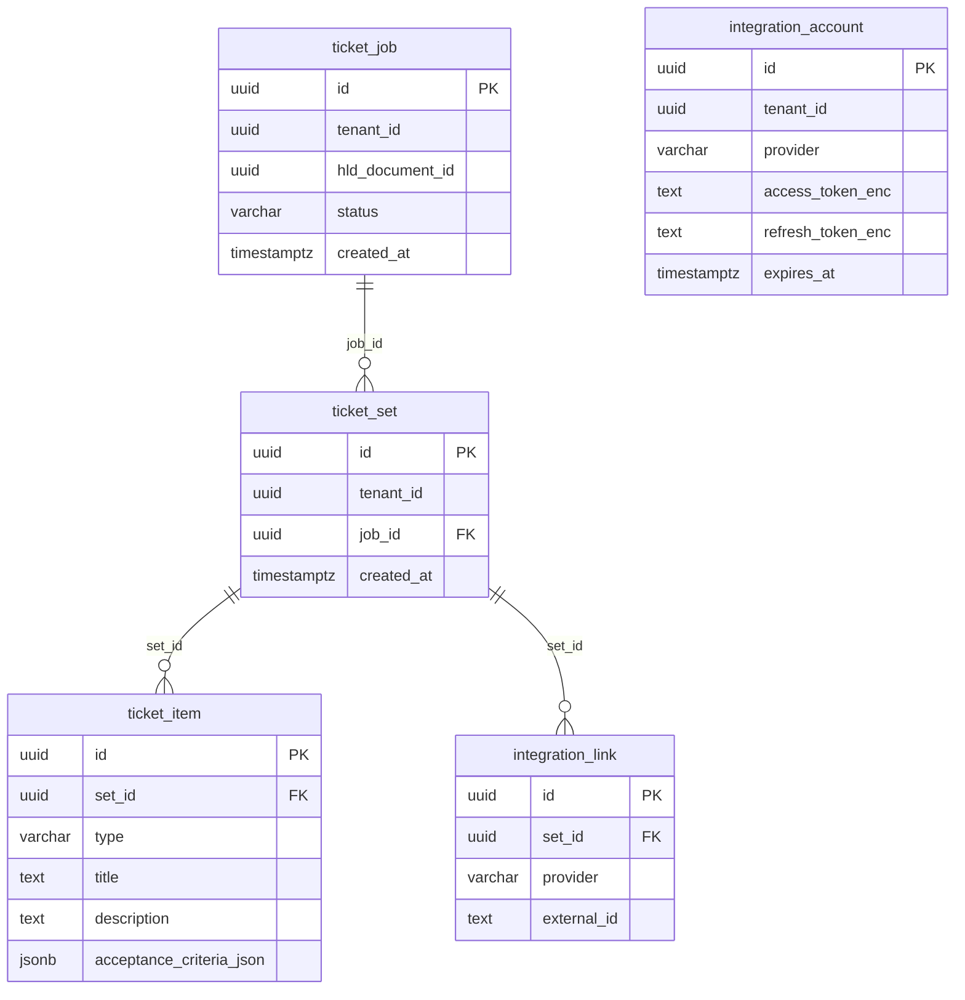

# Ticket Slicer Service ERD

Assumption: integration_link.provider corresponds to integration_account.provider; the link is enforced at the application layer.

```mermaid
erDiagram
  ticket_job ||--o{ ticket_set : "job_id"
  ticket_set ||--o{ ticket_item : "set_id"
  ticket_set ||--o{ integration_link : "set_id"

  ticket_job {
    uuid id PK
    uuid tenant_id
    uuid hld_document_id
    varchar status
    timestamptz created_at
  }

  ticket_set {
    uuid id PK
    uuid tenant_id
    uuid job_id FK
    timestamptz created_at
  }

  ticket_item {
    uuid id PK
    uuid set_id FK
    varchar type
    text title
    text description
    jsonb acceptance_criteria_json
  }

  integration_account {
    uuid id PK
    uuid tenant_id
    varchar provider
    text access_token_enc
    text refresh_token_enc
    timestamptz expires_at
  }

  integration_link {
    uuid id PK
    uuid set_id FK
    varchar provider
    text external_id
  }
```
